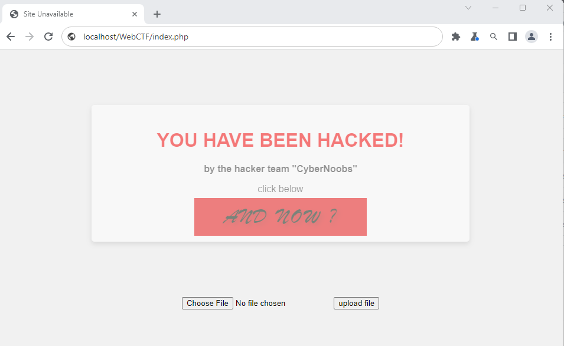
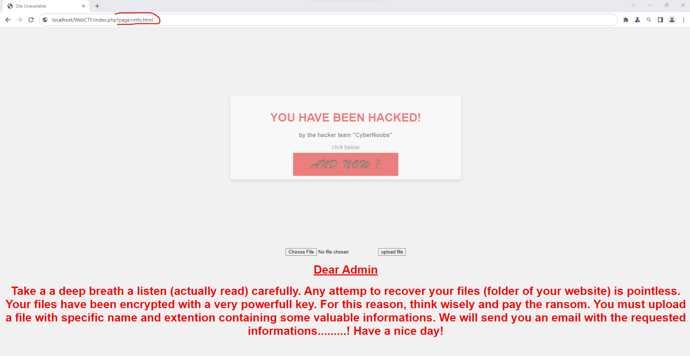
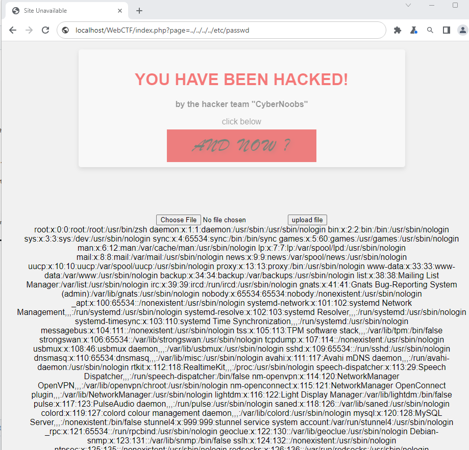
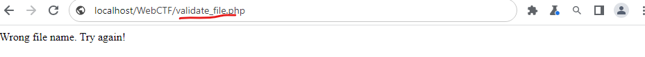
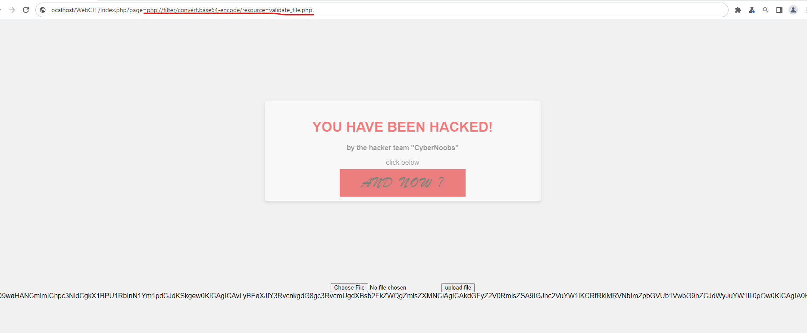
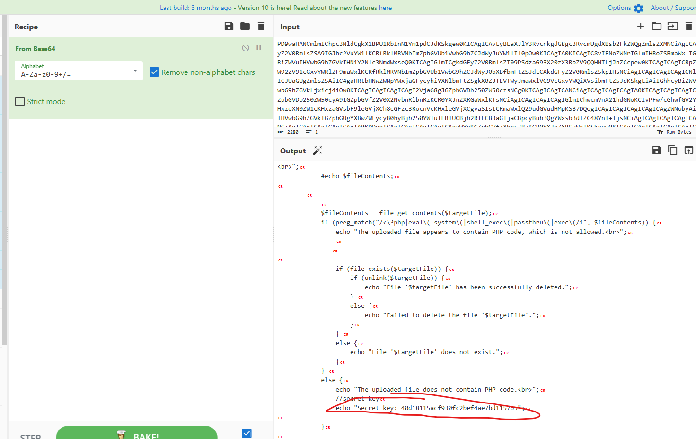
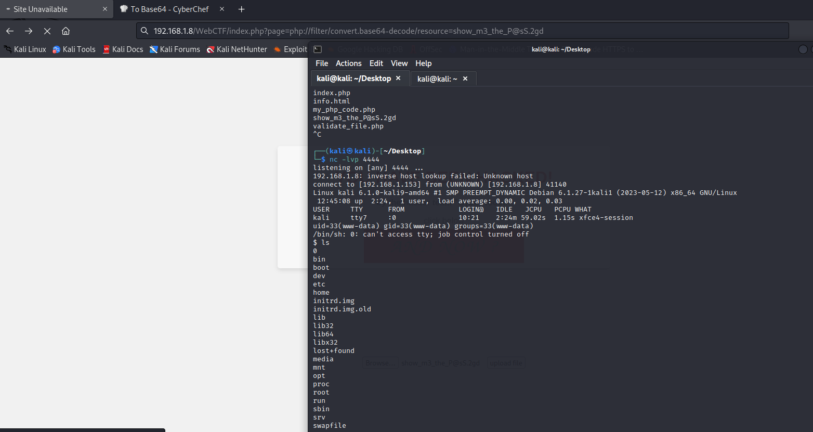
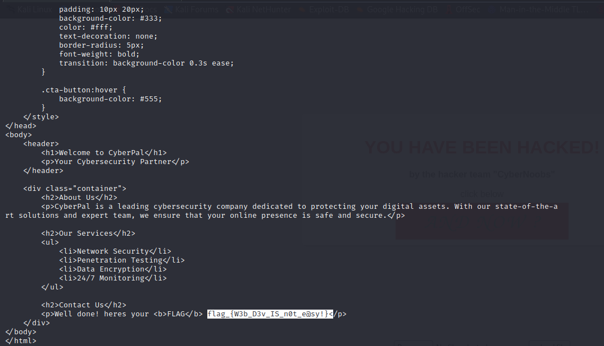

# 
  <WEB CTF> Toy website hijack   

1. Open browser and hit the url.

 

As we can see the site is under attack. 
If we click the red area (AND NOW?) we get the message of the image below.
As we can see (in the url) the site may have some kind of file inclusion vulnerability (check the url of image).

We can confirm that if we hit in the browser <b>localhost/WebCTF/index.php?page=../../../../etc/passwd</b>

We must upload a file with specific (unknown) format in order to get the key and decrypt the zip file that contains the hijacked webpage(html code).
If we upload a file we get the message of the image.

based on hint 2 we must somehow view the source code of the "validate_file.php" file in order to obtain the key-password.
Atltough there is an LFI vulnerability we cannot see directly the content of a php file.
However, we can read the base64 encoding of the file with the command
<b>localhost/WebCTF/index.php?page=php://filter/convert.base64-encode/resource=validate_file.php</b>

Then we can decode the base64 format with a tool (e.g cyberchef) and obtain the password

Doing a deeper inspection we can see that there exists some filters that checks the name of file and also if any php code is contained in the uploaded file. 
This is not a problem! We can bypass these filters by encoding our php code to base64 and then uploading it to the server.
We can use a php reverse shell payload (e.g pentestmonkey website). 
in order to execute linux commands in the server. In that way we can achieve a reverse shell .

Then from the attacker's machine we execute <b>nc -lvp 4444</b> and then in browser execute the command <b>../index.php?page=php://filter/convert.base64-decode/resource=show_m3_the_P@sS.2gd</b>

In the end we unzip the file with the command <b>unrar -x CyberComSite.rar</b> and read the <i>CyberCom.html</i> source code to find the flag.

