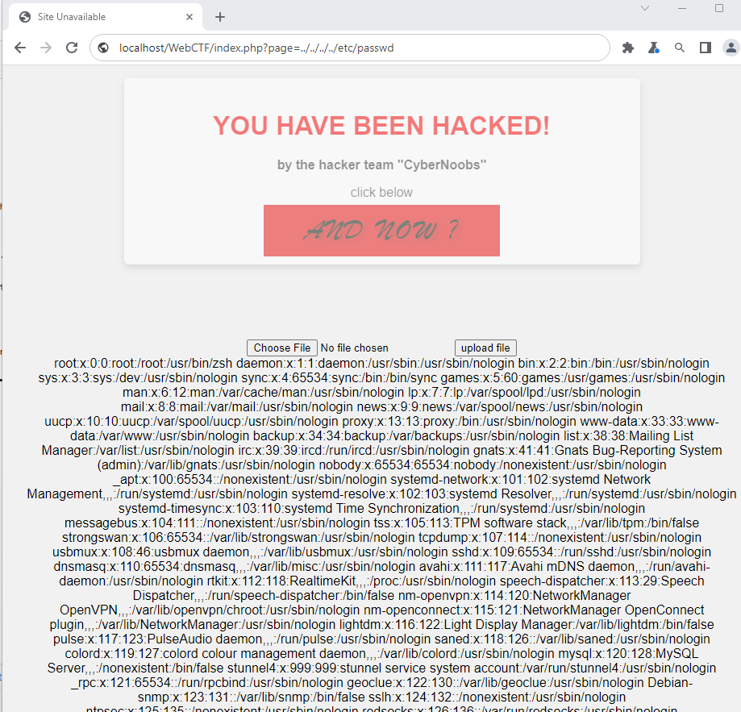
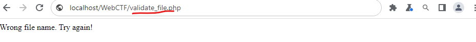
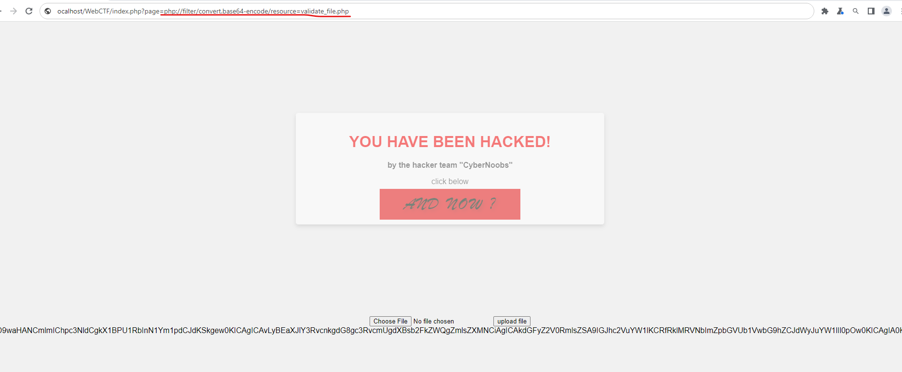
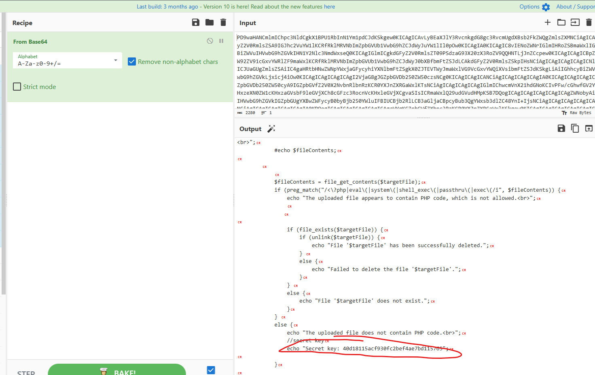
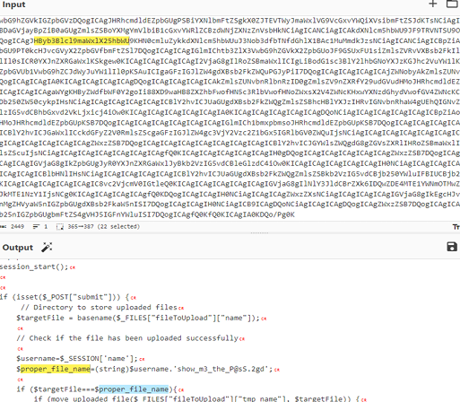
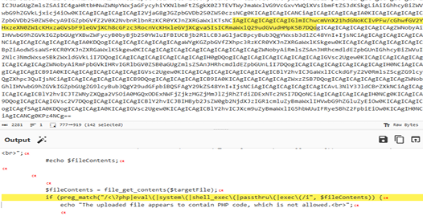
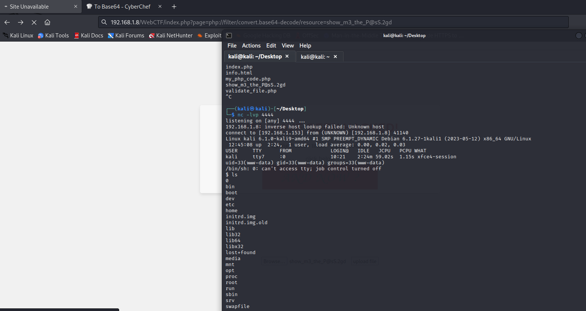
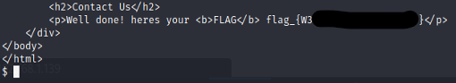

# 🛡️ Site Compromised — Web Exploitation Write-Up

## 1. Executive Summary
The “Site Compromised” challenge contains a **Local File Inclusion (LFI)** vulnerability that can be chained with **PHP filter abuse** and **file upload bypass techniques** to achieve **full Remote Code Execution (RCE)** on the server.  
By leveraging these flaws, an attacker can access sensitive files, read source code, upload an encoded PHP shell, decode and execute it, retrieve the compromised website files and obtain the final flag.

---

## 2. Impact (Risk Assessment)

| Severity | Impact |
|----------|--------|
| **Critical** | Arbitrary file read, full compromise, credential disclosure, remote command execution |

An attacker can:
- Read system files (`/etc/passwd`)
- Extract application source code
- Bypass file upload validation
- Execute arbitrary commands (reverse shell)
- Access protected web content

---

# 3. Technical Analysis

## 3.1 Initial Discovery
The webpage displays a defaced message.  
Clicking the red button triggers a URL with a `page` parameter:

```
index.php?page=info.html
```
<p align="center">
	
</p>

---
## 3.2 Confirming LFI
Using directory traversal payload:

```
http://localhost/WebCTF/index.php?page=../../../../etc/passwd
```

The server outputs `/etc/passwd`, confirming **Local File Inclusion**.

<p align="center">
	
</p>

---

## 3.3 Goal Identification
A `.rar` archive contains the hijacked webpage.  
To decrypt it, the attacker must retrieve a **key-password**, which is likely stored in the file validation logic (`validate_file.php`).

The upload form rejects files with:

> “Wrong filename format.”

<p align="center">
	
</p>

---

## 3.4 Reading PHP Source via PHP Filters
Direct PHP source cannot be viewed because PHP executes it.  
Using `php://filter`, we force PHP to output the file in base64:

```
http://localhost/WebCTF/index.php?page=php://filter/convert.base64-encode/resource=validate_file.php
```

<p align="center">
	
</p>


Decoding the base64 output reveals:
- The required key-password
<p align="center">
	
</p>

- Filename checks
 <p align="center">
	
</p>

- Upload filtering logic
 <p align="center">
	
</p>

- Possible bypass vectors

---

## 3.5 File Upload Filter Analysis
The validation script contains:
- Whitelist checks  
- Regex detection for PHP code  
- Basic extension filtering  

Weakness:
> **No detection of encoded payloads (e.g., base64-encoded PHP).**

This provides a bypass.

---

## 3.6 Filter Bypass → RCE via Base64-Encoded PHP Shell
A PHP reverse shell  is **base64-encoded** and uploaded to evade validation.

Attacker sets listener:

```
nc -lvp 4444
```

The payload is executed using PHP filter decoding:

```
../index.php?page=php://filter/convert.base64-decode/resource=show_m3_the_P@sS.2gd
```

A reverse shell is successfully established, granting full command execution.

 <p align="center">
	
</p>


---

# 4. Proof of Exploitation
Evidence includes:
- `/etc/passwd` output
- Base64 dump of `validate_file.php`
- Decoded PHP source
- Reverse shell connection (netcat)


---

# 5. Post-Exploitation & Flag Retrieval

1. Use the extracted password from `validate_file.php`.
2. Extract the hijacked website:

```
unrar -x CyberComSite.rar
```

3. Open `CyberCom.html` → retrieve the flag.

<p align="center">
	
</p>
---

# 6. Root Cause Analysis

### ✔ Unsanitized file inclusion
User input is passed directly into an include statement.

### ✔ Insufficient file upload validation
Filters block raw PHP but not encoded payloads.

### ✔ PHP stream wrappers enabled
`php://filter` allowed full source disclosure.

### ✔ No path enforcement
Absence of sanitization such as `realpath()`.

---

# 7. Remediation Recommendations

### Immediate Fixes
- Enforce strict whitelist for file inclusion.
- Disable PHP stream wrappers in production.
- Avoid dynamic includes from user input.
- Improve file upload validation:
  - MIME-type verification
  - Server-side renaming
  - Strict extension control
  - Deep content inspection

### Long-Term Improvements
- Apply WAF rules for LFI patterns.
- Implement least-privilege filesystem permissions.
- Use SAST tools to detect insecure file operations.

---

# 8. Lessons Learned
- LFI combined with PHP filters can escalate to full RCE.
- Encoding is not an effective security control.
- Upload validation must handle encoded and obfuscated payloads.
- Access to source code is often the pivot point in exploitation chains.


